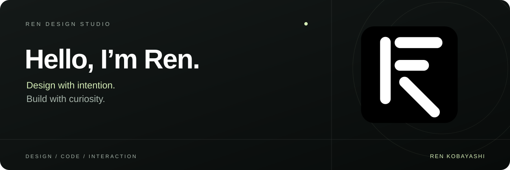

<picture>
  <source media="(prefers-color-scheme: dark)" srcset="assets/hello-dark.svg">
  <source media="(prefers-color-scheme: light)" srcset="assets/hello-light.svg">
  
</picture>

探索设计、代码与交互，把想法变成作品。

  <a href="https://greentailtohru-arch.github.io/Personal-Website/A.html">个人网站</a> ·
  <a href="https://greentailtohru-arch.github.io/Tomatotodo/">Tomatotodo</a> ·
  <a href="https://github.com/GreentailTohru-arch?tab=repositories">全部作品</a>

